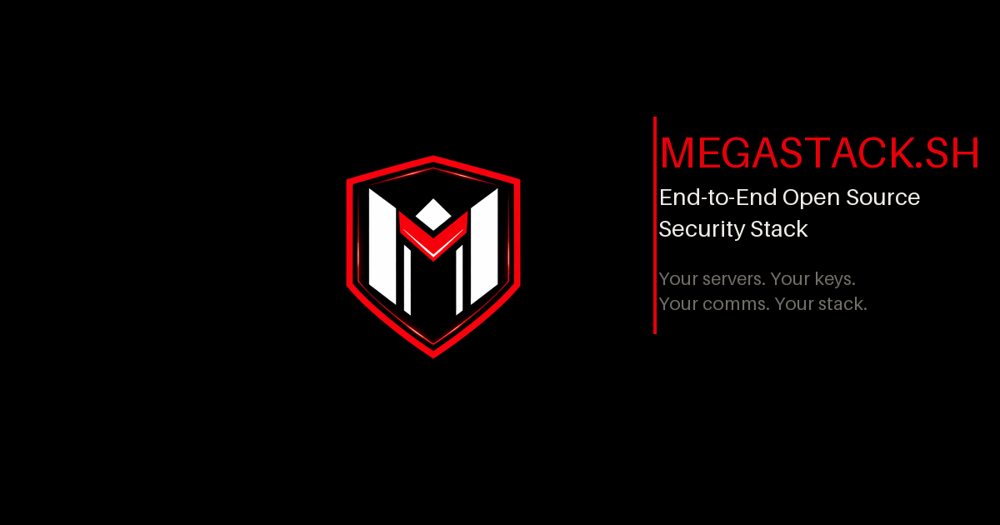

# megastack.sh

> **End-to-End Open Source Security Stack**  
> Corporate-grade security at startup-friendly pricing — deployed on infrastructure you own.



---

## Overview

megastack.sh is a security consultancy that deploys a complete, battle-hardened open-source security stack on servers and devices you control. No black-box SaaS. No vendor lock-in. No trust required — just code you can read and infrastructure you own.

**Live site:** [https://megastack.sh](https://megastack.sh)  
**Contact:** [hi@megastack.sh](mailto:hi@megastack.sh)

---

## The Stack

### Core Layers (deployed on every engagement)

| # | Tool | Layer | Purpose |
|---|------|-------|---------|
| L1 | [WireGuard](https://github.com/WireGuard/wireguard-linux) | VPN Backbone | Encrypted mesh — all other services tunnel through it |
| L2 | [Hoodik](https://github.com/hudikhq/hoodik) | Encrypted File Storage | E2E encrypted file hosting — SSH keys, certs, secrets |
| L3 | Custom nftables/iptables | Hardened Firewall | Deny-all policies — internal services unreachable off-mesh |
| L4 | Notion / Plane templates | Access Management | Key rotation, peer onboarding, incident logs |
| L5 | [Matrix + Element (Synapse)](https://github.com/element-hq/synapse) | Secure Comms | Self-hosted E2E encrypted messaging, zero third-party metadata |
| L6 | [Authelia](https://github.com/authelia/authelia) | 2FA Server | Self-hosted TOTP — your tokens, your hardware keys |
| L7 | Resilio Sync | P2P File Sync | BitTorrent-based sync across devices, no cloud |
| L8 | [topgrade](https://github.com/paulfxyz/topgrade) | Fleet Updates | One command updates everything — Mac, Windows, Linux |
| L9 | [Wasabi Wallet](https://github.com/WalletWasabi/WalletWasabi) | Bitcoin Reserve | CoinJoin + Tor routing — private Bitcoin infrastructure |

### Extended Toolbox (scoped per engagement)

| Tool | Category |
|------|----------|
| [OpenVAS / Greenbone](https://github.com/greenbone/openvas-scanner) | Vulnerability Scanning |
| [Trivy](https://github.com/aquasecurity/trivy) | Container & Cloud Security |
| [Falco](https://github.com/falcosecurity/falco) | Runtime Security Monitoring |
| [Semgrep](https://github.com/semgrep/semgrep) | Static Code Analysis |
| [Gitleaks](https://github.com/gitleaks/gitleaks) | Secret Detection |
| [OWASP ZAP](https://github.com/zaproxy/zaproxy) | Web App Security Testing |
| Nmap | Network Discovery |
| Wazuh | SIEM / Host Intrusion Detection |
| Snort / Suricata | Network Intrusion Detection |
| ClamAV | Antivirus |
| Fail2Ban | Brute-force Protection |
| Lynis | System Hardening Audit |
| OSSEC | Host-based IDS |

---

## Repository Structure

```
megastack-website/
├── index.html          # Single-page landing site (self-contained HTML/CSS/JS)
├── assets/
│   ├── logo-2500.png              # Master logo — 2500×2500
│   ├── favicon.ico                # Multi-size (16/32/48px)
│   ├── favicon-16x16.png
│   ├── favicon-32x32.png
│   ├── favicon-48x48.png
│   ├── apple-touch-icon.png       # 180×180 — iOS home screen
│   ├── android-chrome-192x192.png
│   ├── android-chrome-512x512.png
│   ├── mstile-150x150.png         # Windows tile
│   ├── og-image.png               # 1200×630 — Open Graph / Twitter card
│   └── site.webmanifest           # PWA manifest
└── README.md
```

---

## Deployment

The site is a zero-dependency static HTML file. No build step required.

### Via FTP (SiteGround — production)

```bash
curl --ftp-ssl \
  --user "ftp@megastack.sh:PASSWORD" \
  --upload-file index.html \
  "ftp://es7.siteground.eu/megastack.sh/public_html/index.html"

# Upload assets (first time or when updated)
for f in assets/*; do
  curl --ftp-ssl \
    --user "ftp@megastack.sh:PASSWORD" \
    --upload-file "$f" \
    "ftp://es7.siteground.eu/megastack.sh/public_html/$f"
done
```

### Locally

```bash
# Any static server works
npx serve .
# or
python3 -m http.server 8080
```

---

## Features

- **Pure static HTML** — no framework, no build tool, no runtime dependencies
- **Matrix rain + radar canvas** — animated background effects (WebGL-free, Canvas 2D)
- **Omnipresent char flicker** — ambient character-level glitch across all text nodes
- **Hero glitch effect** — CSS clip-path animation on the wordmark
- **Booking modal** — 3-step form with 2-week day picker, sends email via Resend API
- **Scroll-triggered fade-ins** — IntersectionObserver-based, no library
- **Mobile-first responsive** — 4 breakpoints: 1400px / 900px / 640px / 440px
- **Full SEO + social meta** — OG, Twitter card, Apple touch icon, PWA manifest

---

## Booking / Lead Flow

When a visitor submits the booking form, an email is sent via [Resend](https://resend.com):

- **From:** `lead@megastack.sh`
- **To:** `hello@paulfleury.com`
- **Reply-to:** visitor's email
- **Subject:** `📡 New booking — [Name] ([Org]) — [Day]`
- **Body:** Full booking details — name, org, email, Signal/Matrix, preferred day, call platform, context

---

## Team

| Role | Name | Handle |
|------|------|--------|
| Founder & CEO | Paul Fleury | [paulfxyz](https://linkedin.com/in/paulfleury) |
| Security Advisor | Clément Domingo | [SaxX](https://linkedin.com/in/clementdomingo) |
| Breach Intelligence Advisor | Sébastien Raoult | [ShinyHunters](https://en.wikipedia.org/wiki/ShinyHunters) |

Plus a worldwide collective of ~12 vetted sysops and security researchers for on-site and remote deployments.

---

## Versioning

This project follows [Semantic Versioning](https://semver.org/):

- `MAJOR` — complete redesign or structural rebuild
- `MINOR` — new sections, features, significant content additions
- `PATCH` — copy edits, style tweaks, bug fixes

| Version | Date | Changes |
|---------|------|---------|
| `v1.0.0` | 2026-04-26 | Initial launch — full landing page, 9-layer stack, booking modal |
| `v1.1.0` | 2026-04-26 | Wasabi Wallet layer added (L9) |
| `v1.2.0` | 2026-04-26 | Extended toolbox (OpenVAS, Trivy, Falco, Semgrep, Gitleaks, ZAP), team hierarchy, package section |
| `v1.3.0` | 2026-04-26 | Resend email integration, larger hero headline, favicon/OG assets, README |

---

## License

All **source code** (HTML, CSS, JS) in this repository is © 2026 megastack.sh. All rights reserved.  
All referenced **open-source tools** remain under their respective licenses.

---

*Built with [proxy.sh](https://proxy.sh) vibes. Secured with our own stack.*
